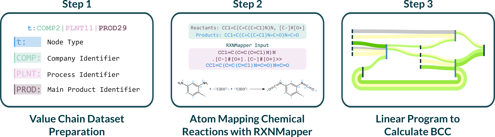

#  &mdash; Carbon Atom Tracker

[](https://doi.org/10.5281/zenodo.16851777)
[](https://github.com/EmPajak21/carat/actions/workflows/run-tests.yml/badge.svg)
[](https://www.python.org/downloads/)
[](https://github.com/astral-sh/ruff)
[](https://github.com/astral-sh/uv)

CarAT (Carbon Atom Tracker) is an automated tool designed to track biogenic carbon content (BCC) across complex industrial value chains. With the Together for Sustainability (TfS) consortium mandating BCC reporting by 2026 ([TfS Guidelines][reference1]), CarAT offers a scalable solution to this critical industry challenge. Additionally, it serves as a decision support tool for decarbonisation strategies by facilitating the substitution of fossil carbon with biogenic carbon.

## 🏭 The Need for CarAT in the Chemicals Industry

The chemicals industry is under increasing pressure to reduce its carbon footprint and transition toward sustainable practices. Accurately calculating BCC presents significant challenges due to:

- The dependency of products' BCC on all contributing feedstocks throughout the value chain.
- The influence of process efficiencies and variables on carbon distribution.
- The complexity and interconnectedness of value chains.
- The time-consuming and error-prone nature of manual calculations.

CarAT addresses these challenges by leveraging existing Enterprise Resource Planning (ERP) data through a systematic three-stage approach.

## ⚙️ Methodology of CarAT



CarAT's methodology comprises three primary stages:

1. **Data Preparation**: Processes value chain data extracted from existing ERP systems.
2. **Atom Mapping**: Utilises RXNMapper from [Schwaller et al.][reference2] to track atoms through chemical reactions.
3. **Optimisation**: Applies linear programming to compute BCC across the entire value chain.

### Linear Program Formulation

$$
\begin{alignedat}{4}
& \text{minimize} && \sum_{cbgpse}(z_{cbgpse}-q_{cbgpse})+\sum_{cpse}(z_{cpse}-q_{cpse}) \quad\quad\quad\quad\quad && &&(a) \\
& \text{s.t.} && && && \\
& && \beta_{cbgpsea} = \sum_{p's'}\psi_{p's'pse}\ \beta_{cp's'ea} \:,
&&\quad \forall c,b,g,p,s,e,a \quad && (b) \\
& && \beta_{cpsea} = \sum_{c'b'g'}\mu_{c'b'g'cp}\ \beta_{c'b'g'psea} \:,
&&\quad \forall c,p,s,e,a && (c) \\
& && \sum_a \beta_{cbgpsea}-z_{cbgpse}-q_{cbgpse}=1,
&&\quad \forall c,b,g,p,s,e && (d) \\
& && \sum_a \beta_{cpsea}-z_{cpse}-q_{cpse}=1,
&&\quad \forall c,p,s,e && (e) \\
& && \beta_{cbgpsea} \in [0,1],
&&\quad \forall c,b,g,p,s,e,a && (f) \\
& && \beta_{cpsea} \in [0,1],
&&\quad \forall c,p,s,e,a && (g) \\
& && z_{cbgpse} \in \mathbb{R}^+, \quad q_{cbgpse} \in \mathbb{R}^-,
&&\quad \forall c,b,g,p,s,e && (h) \\
& && z_{cpse} \in \mathbb{R}^+, \quad q_{cpse} \in \mathbb{R}^-,
&&\quad \forall c,p,s,e && (i)
\end{alignedat}
$$


*N.B. $c'$ denotes the inlet company code, whereas $c$ denotes the outlet company code.*

**Table 1. Value chain indices**


| Index | Description |
|-------|-------------|
| $a$ | Elemental attribute (e.g., biogenic, fossil, etc.) |
| $b$ | Business process, anonymized coding: PLNTb |
| $c$ | Company code, anonymized coding: COMPc |
| $e$ | Element (e.g., carbon) |
| $g$ | Main product, same structure as $p$ |
| $p$ | Product, anonymized coding: PRODp |
| $s$ | Substance, represented by SMILES |


**Table 2. Decision variables, slack variables, and parameters**

| Notation | Description |
|----------|-------------|
| $\beta_{cbgpsea}$ | Fraction of elemental attribute $a$ of element $e$ in substance $s$, material $p$, at production node $(c, b, g) $. |
| $\beta_{cpsea}$ | Fraction of elemental attribute $a$ of element $e$ in substance $s$, material $p$, at mix node $(c, p) $. |
| $z_{cbgpse}$ | Positive slack variable for element $e$ in substance $s$, material $p$, at production node $(c, b, g)$. |
| $q_{cbgpse}$ | Negative slack variable for element $e$ in substance $s$, material $p$, at production node $(c, b, g)$. |
| $z_{cpse}$ | Positive slack variable for element $e$ in substance $s$, material $p$, at mix node $(c, p)$. |
| $q_{cpse}$ | Negative slack variable for element $e$ in substance $s$, material $p$, at mix node $(c, p) $. |
| $\mu_{c'b'g'cp}$ | Mix node share, i.e., the fraction of a virtual tank $(c,p)$ sourced from a production node $(c',b',g') $. |
| $\psi_{p's'pse}$ | Bill-of-atoms, i.e., the fraction of element $e$ in substance $s$ in product $p$, sourced from substance $s'$ in product $p'$. |

## 🚀 Getting Started  

To begin using CarAT, clone the repository and set up the environment using [uv](https://docs.astral.sh/uv/).

### Installation

1. **Install uv** (if not already installed)
   ```bash
   # On Windows
   powershell -c "irm https://astral.sh/uv/install.ps1 | iex"
   
   # On macOS/Linux
   curl -LsSf https://astral.sh/uv/install.sh | sh
   ```

2. **Clone and setup the project**
   ```bash
   git clone https://github.com/EmPajak21/CarAT.git
   cd CarAT
   uv sync
   ```

3. **Install development dependencies** (optional)
   ```bash
   uv sync --group dev
   ```

## 📈 Example Usage

For a comprehensive walkthrough of CarAT's functionality, refer to the included Jupyter notebook:  
[tdi_value_chain.ipynb](tdi_value_chain.ipynb)

This example demonstrates the complete workflow, including:

- Loading and visualising a value chain graph.
- Computing the bill of atoms using RXNMapper.
- Preprocessing data for linear programming (LP) formulation.
- Solving the LP optimisation model.
- Generating Sankey diagrams to visualise results.

*Note: The linear programming formulation developed for CarAT is documented in `carat/core/linear_program.md`.*

[reference1]: https://www.tfs-initiative.com/app/uploads/2024/03/TfS_PCF_guidelines_2024_EN_pages-low.pdf "Together for Sustainability (TfS). (2024). Product Carbon Footprint (PCF) Guidelines. TfS Initiative."

[reference2]: https://www.science.org/doi/10.1126/sciadv.abe4166 "Schwaller, P., Hoover, B., Reymond, J.-L., Strobelt, H., & Laino, T. (2021). Extraction of organic chemistry grammar from unsupervised learning of chemical reactions. Science Advances, 7(15), eabe4166."


## 📝 Citation

The corresponding manuscript for this repository is currently under preparation. In the interim, please cite this work as follows:

*Pajak, E., Walz, D., Walz, O., Helleckes, L. M, Hellgardt, K. and del Rio Chanona, A. CarAT: Carbon Atom Tracing across Industrial Chemical Value Chains via Chemistry Language Models. (Manuscript in preparation)*

## ⚖️ License

This project is licensed under the GNU Affero General Public License v3.0. See the [LICENSE](LICENSE.md) file for details.