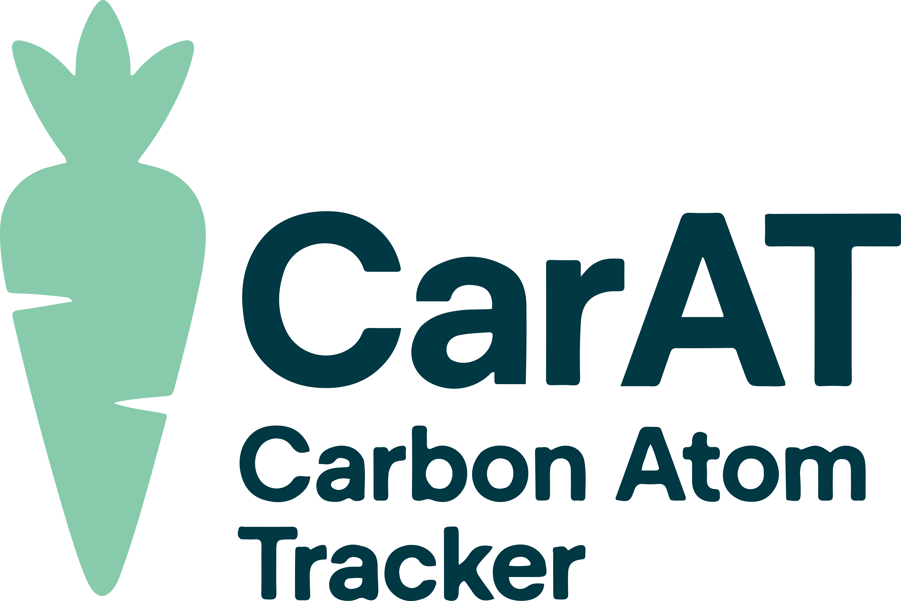

#  &mdash; Carbon Atom Tracker

[](https://github.com/EmPajak21/carat/actions/workflows/run-tests.yml/badge.svg)
[](https://www.python.org/downloads/release/python-390/)
[](https://github.com/psf/black)

CarAT (Carbon Atom Tracker) is an automated tool designed to track biogenic carbon content (BCC) across complex industrial value chains. With the Together for Sustainability (TfS) consortium mandating BCC reporting by 2026 ([TfS Guidelines][reference1]), CarAT offers a scalable solution to this critical industry challenge. Additionally, it serves as a decision support tool for decarbonisation strategies by facilitating the substitution of fossil carbon with biogenic carbon.

## 🏭 The Need for CarAT in the Chemicals Industry

The chemicals industry is under increasing pressure to reduce its carbon footprint and transition toward sustainable practices. Accurately calculating BCC presents significant challenges due to:

- The dependency of products' BCC on all contributing feedstocks throughout the value chain.
- The influence of process efficiencies and variables on carbon distribution.
- The complexity and interconnectedness of value chains.
- The time-consuming and error-prone nature of manual calculations.

CarAT addresses these challenges by leveraging existing Enterprise Resource Planning (ERP) data through a systematic three-stage approach.

## ⚙️ Methodology of CarAT


CarAT's methodology comprises three primary stages:

1. **Data Preparation**: Processes value chain data extracted from existing ERP systems.
2. **Atom Mapping**: Utilises RXNMapper from [Schwaller et al.][reference2] to track atoms through chemical reactions.
3. **Optimisation**: Applies linear programming to compute BCC across the entire value chain.

## 🚀 Getting Started  

To begin using CarAT, clone the repository and set up the environment using Conda.

1. **Create the Environment**  
    ```bash  
    conda env create -f environment.yml  
    ```  

2. **Activate the Environment**  
    ```bash  
    conda activate carat  
    ```

## 📈 Example Usage

For a comprehensive walkthrough of CarAT's functionality, refer to the included Jupyter notebook:  
[tdi_value_chain.ipynb](tdi_value_chain.ipynb)

This example demonstrates the complete workflow, including:

- Loading and visualising a value chain graph.
- Computing the bill of atoms using RXNMapper.
- Preprocessing data for linear programming (LP) formulation.
- Solving the LP optimisation model.
- Generating Sankey diagrams to visualise results.

*Note: The linear programming formulation developed for CarAT is documented in `carat/core/linear_program.md`.*

[reference1]: https://www.tfs-initiative.com/app/uploads/2024/03/TfS_PCF_guidelines_2024_EN_pages-low.pdf "Together for Sustainability (TfS). (2024). Product Carbon Footprint (PCF) Guidelines. TfS Initiative."

[reference2]: https://www.science.org/doi/10.1126/sciadv.abe4166 "Schwaller, P., Hoover, B., Reymond, J.-L., Strobelt, H., & Laino, T. (2021). Extraction of organic chemistry grammar from unsupervised learning of chemical reactions. Science Advances, 7(15), eabe4166."

## 📝 Citation

The corresponding manuscript for this repository is currently under preparation. In the interim, please cite this work as follows:

*Pajak, E., Walz, D., Walz, O., Hellgardt, K. and del Rio Chanona, A. CarAT: Carbon Atom Tracing across Industrial Chemical Value Chains via Chemistry Language Models. (Manuscript in preparation)*
